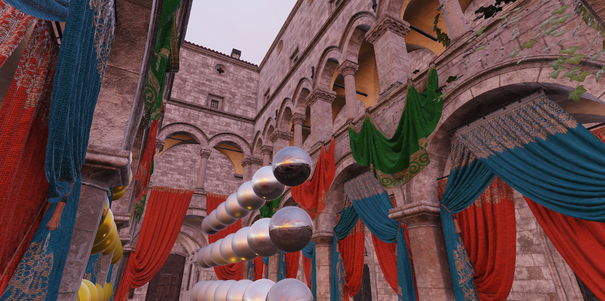

# Limbo

## Overview
"Limbo" is my personal toy renderer meant as playground to try ideas and rendering techniques.

## Requirements
- CMake 3.22 or newer
- Visual Studio 2019
- Windows SDK 10.0.19041.0 or later for DX12 support
- DXR compatible GPU with Resource Heap Tier 3 support
 
## Building
- Run `generate_vs2022.bat` to generate VS project files.
- Open `build/limbo.sln` and Compile/Run

## Some notable features
- Bindless resources, including Vertex Pulling
- Deferred shading
- Shader hot-reloading
- Screen space ambient occlusion
- Image Based Lighting
- Cook-Torrance specular BRDF (w/ Lambertian diffuse)

